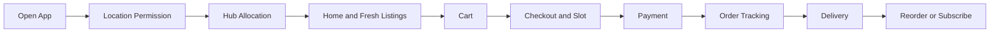
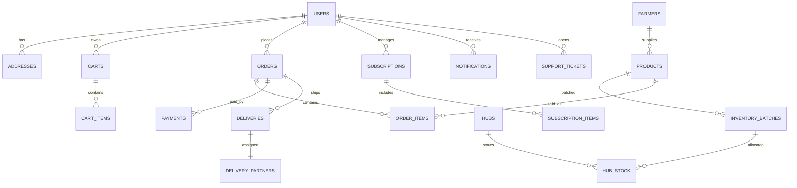

# Consumer Operations System

This document defines the complete consumer-side operations system for a farmer -> hub -> customer commerce model. It covers UX, navigation, UI modules, backend flows, data relationships, and operational intelligence.

## 1. Product Objectives
- Deliver fresh produce with transparent farm-to-hub provenance and fast delivery.
- Reduce decision friction with freshness, ETA, and local hub signals.
- Enable scale via hub-aware inventory, dynamic pricing, and routing logic.
- Keep the experience premium, minimal, and fast on mobile.

## 2. Experience Principles
- Trust-first: show harvest time, farm origin, and hub handling status on every critical screen.
- Speed-first: minimize taps to buy and to track delivery.
- Local-first: surface nearby farms and hub inventory before long-distance items.
- Ops-aware UI: show slot capacity, surge windows, and low stock transparently.
- Subscriptions as a core loop: encourage daily and weekly staples.

## 3. Core Consumer Flow
1) Open app -> location permission -> detect nearest hub
2) Browse fresh listings -> add to cart
3) Choose delivery slot -> pay
4) Track order -> receive
5) Reorder or subscribe

Mermaid flow:

## 4. Navigation System
Primary tabs (consumer):
- Home: discovery, fresh arrivals, delivery ETA
- Shop: listing and search
- Orders: active and past, tracking
- Profile: addresses, payments, subscriptions, support

Secondary routes:
- Product detail
- Cart
- Checkout
- Notifications
- Support
- Subscriptions

## 5. Authentication and Onboarding
Screens and logic:
- Splash -> onboarding slides -> OTP login
- Google login (fast track)
- Guest browsing allowed, but cart and checkout require login
- Location permission screen with a clear benefit message
- Auto address detection with edit option

Required UX behaviors:
- OTP auto-focus and auto-advance
- Resend timer and fallback to call or WhatsApp
- One-tap continue as guest

## 6. Screen Blueprints (Mobile)

### 6.1 Home
Layout:
- Top app bar with location chip and ETA
- Search bar with scoped categories
- Category chips row
- Dynamic banner carousel
- Sections in this order:
  - Express delivery
  - Fresh arrivals
  - Seasonal picks
  - Nearby stock
  - Subscriptions
  - Essentials
  - Offers and combos
  - Recommended

Home logic:
- Show only hub-available inventory by default
- Badge low stock and harvested-today items
- Personalize by previous purchases and time of day

### 6.2 Product Listing
Card requirements:
- Image, name, price per unit
- Freshness indicator and harvested timestamp
- Farmer badge and hub ETA
- Stock count with low-stock warning
- Add and quantity stepper
- Dynamic pricing label with strike-through when discounted

Listing features:
- Filters: category, harvest age, distance, price
- Sort: freshness, ETA, price, rating
- Real-time stock badge updates

### 6.3 Product Detail
Modules:
- Image gallery
- Origin and farmer section
- Freshness details and harvest time
- Nutrition and quality indicators
- Price breakdown (farm, hub, delivery)
- Similar products
- Reviews
- Sticky add to cart with quantity

### 6.4 Cart
Operations:
- Real-time stock validation
- Min order validation
- Delivery fee, packaging fee, platform fee
- Coupon apply with rule checks
- Savings summary

Cart UI:
- Delivery ETA card
- Item list with inline quantity
- Bill breakdown
- Primary CTA to checkout

### 6.5 Checkout
Required sections:
- Address selector and add new
- Delivery instructions
- Slot selection (capacity and surge)
- Payment method (UPI, card, wallet, COD)
- Order summary

Logic:
- Smart slot suggestions based on hub capacity and user history
- Surge pricing visible before payment
- Prevent checkout when stock is insufficient

### 6.6 Order Management and Tracking
States:
- Order placed -> picked -> packed at hub -> out for delivery -> delivered

Tracking features:
- Live map view
- Delivery partner info
- ETA updates
- Support entry points

### 6.7 Subscriptions
Plans:
- Daily milk
- Weekly vegetables
- Fruits bundle

Controls:
- Pause, skip, reschedule
- Address and slot preferences
- Payment method per subscription

### 6.8 Support
Channels:
- AI chat with quick actions
- Human escalation
- Refund and replacement flow

### 6.9 Notifications
Types:
- Order status and ETA
- Flash sale and expiry discounts
- Subscription reminders
- Personalized recommendations

## 7. Component Hierarchy

Atoms:
- Button, chip, badge, icon, input, toggle, price label, status dot

Molecules:
- Product card, farmer badge, freshness tag, slot chip, coupon row

Organisms:
- Home section carousel, product grid, cart list, bill summary, tracking timeline

Screens:
- Home, listing, detail, cart, checkout, orders, tracking, subscriptions, support, profile

## 8. Operational Architecture

Services (Node.js + Express):
- Auth and identity
- Catalog and pricing
- Inventory and batch management
- Cart and checkout
- Orders and payments
- Routing and delivery
- Notifications
- Subscriptions
- Support

Event-driven triggers:
- Inventory updated -> update listings -> notify low stock
- Order placed -> reserve inventory -> assign hub -> schedule delivery
- Delivery status -> update customer ETA -> send notification

## 9. Backend Flow Logic

### 9.1 Browse and Search
- Resolve user location
- Allocate nearest hub by radius and capacity
- Query hub inventory with freshness and batch filters

### 9.2 Add to Cart
- Validate stock and batch availability
- Reserve soft inventory for a short TTL
- Recalculate dynamic price and fees

### 9.3 Checkout and Place Order
- Hard reserve inventory
- Compute delivery fee by distance and slot demand
- Create order and payment intent
- On payment success, confirm order and assign route

### 9.4 Fulfillment
- Hub picks FIFO batches
- Update batch quantity and quality checks
- Assign delivery partner by route optimizer

### 9.5 Delivery
- Push live status updates
- Handle exceptions (missing items, replacements, refunds)

## 10. Database Relationships

Entities:
- Users, Addresses, Hubs, Farmers
- Products, InventoryBatches, HubStock
- Carts, CartItems
- Orders, OrderItems, Payments
- DeliverySlots, Deliveries, DeliveryPartners
- Subscriptions, SubscriptionItems
- Notifications, SupportTickets

Mermaid ER diagram:

Key constraints:
- Inventory batches have expiry and harvest timestamps
- Hub stock is FIFO and priority-sorted by expiry
- Orders reference hub_id for allocation

## 11. Smart Operations Features
- Hub allocation by distance, capacity, and freshness score
- Dynamic delivery routing by cluster and time window
- Inventory-aware recommendations with expiring stock bias
- Demand-based pricing with guardrails and max caps
- Slot surge pricing during peak demand
- Substitution logic for out-of-stock items

## 12. Startup-Ready Scalability
- Cache hot listings per hub
- Use pub-sub for inventory and delivery events
- Keep read-heavy endpoints separate from write-heavy flows
- Batch notifications to reduce cost
- Support partial fulfillment and split orders

## 13. Operational KPIs
- On-time delivery rate
- Average delivery ETA variance
- Inventory spoilage rate
- Hub picking time
- Subscription retention rate
- Average order value and frequency

## 14. Suggested Tech Stack
- Mobile: React Native or Flutter
- Backend: Node.js + Express
- Database: PostgreSQL for relational integrity or MongoDB for speed of iteration
- State: Redux or Zustand
- Maps: Google Maps API
- Payments: Razorpay, Stripe, UPI

## 15. Implementation Checklist
- Confirm hub allocation rules and radius policies
- Finalize delivery slot capacity model
- Define batch FIFO logic and expiry rules
- Implement real-time stock updates in listing and cart
- Build support workflows for refunds and replacements
